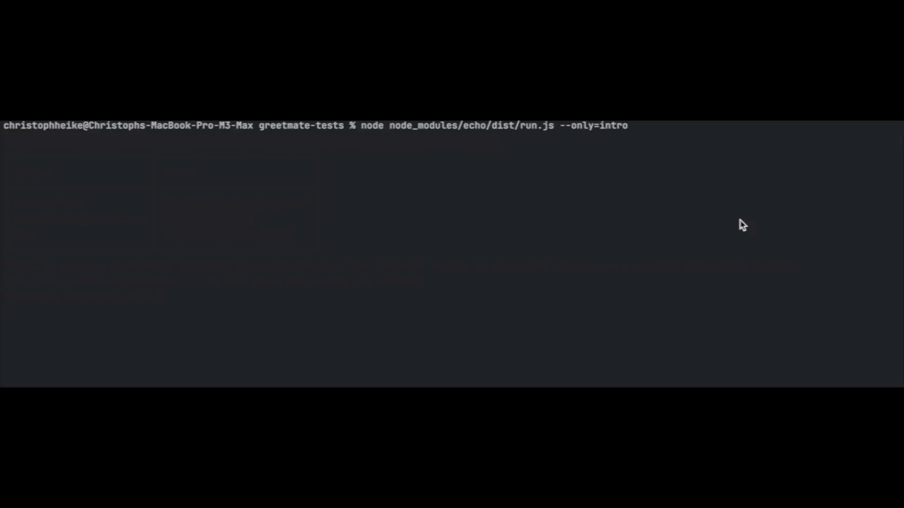

# Echo - An End-to-End Testing Framework for AI Phone Calls

**Testing phone calls is hard. Testing AI-powered phone calls is even harder.** 

As the owner of [Greetmate.ai](https://www.greetmate.ai), we faced challenges in doing quality assurance for our platform. Ensuring that phone calls were testable and consistently performed as expected was very important for us.

*Echo* simplifies this process by providing an end-to-end testing framework tailored for AI phone calls, enabling you to
easily write, execute, and analyze tests.


---

## What Does "End-to-End" Mean?

Echo offers a complete suite of tools out of the box, including:

- **Ngrok Integration**: Seamlessly exposes your local server to the internet for testing.
- **Twilio Client**: Uses Twilio to make and manage phone calls programmatically.
- **Speech-to-Text and Text-to-Speech Engines**: Uses Deepgram and Cartesia for call interactions.



---

## Key Features

- **Simple, Intuitive Syntax**: Write tests that are easy to understand and maintain.
- **Dynamic Response Handling**: Automatically detect when the next transcript is ready and respond with speech.
- **Call Recordings**: Capture and store recordings for detailed analysis.
- **Overlap Detection**: Identify interruptions or overlapping dialogue.
- **Transcription Analysis**: Transcribe audio recordings for further insights.
- **Post-Call AI Analysis**: Leverage AI to evaluate the quality and content of conversations.

---

## Installation

    npm i echo-e2e dotenv

## Configuration

1. To get started, configure your environment variables in a `.env` file:

```dotenv
# Required
DEEPGRAM_API_KEY=          # API key for Deepgram (speech-to-text)
OPENAI_API_KEY=            # API key for OpenAI (AI analysis)
TWILIO_ACCOUNT_SID=        # Twilio Account SID
TWILIO_AUTH_TOKEN=         # Twilio authentication token
TWILIO_FROM_NUMBER=        # Phone number to initiate calls
NGROK_AUTHTOKEN=           # Ngrok authentication token
CARTESIA_API_KEY=          # API key for Cartesia (text-to-speech)
VOICE_ID=                  # Voice ID for Cartesia

# Optional
MAX_CALL_LIFETIME_SECONDS=600  # Maximum call duration (default: 600 seconds)
TEST_TIMEOUT_MS=900000         # Test timeout in milliseconds (default: 900,000 ms)
EVALUATION_MODEL=gpt-4o        # AI model for post-call evaluation
```

2. Make sure you create a directory `./recordings` with approriate write permissions.

## Writing Tests

Tests should be placed in the `./tests` directory. Here's a sample test to get you started:

```javascript
import 'dotenv/config';
import {call} from 'echo';

await call(
    "The call intro is spoken", // Description of the test
    async ({call, assert}) => {
// Actions during the call
        await call.nextTranscript(); // Wait for the other agent's greeting
        await assert.assertLastTranscriptIncludes('Hello'); // Case insensitive

        await call.speak('Hello back! What is your purpose?');

        await call.nextTranscript();
        await assert.assertLastTranscriptIncludes('help you');
    },
    async ({call, transcribedText, assert}) => {
// Actions after the call (e.g., AI analysis)
        await assert.analyzeTranscribedTextWithAI(
            'The conversation is about the call agent offering their help.'
        );
    },
    {
        to: '+15553334444', // Number to call
    }
);
```

## Running The Tests

     node node_modules/echo/dist/run.js

Optional parameters:

- `--only` will run only the test with the given name (`specialtest.test.js` becomes `specialtest`)


## Why Choose Echo?

Save time by automating the testing of complex AI-powered phone call workflows.
Improve quality assurance by detecting errors and issues before deployment.
Harness the power of AI to analyze conversations and provide actionable insights.


## Contributing
We welcome contributions! If you’d like to contribute to Echo, please submit a pull request or create an issue to
discuss your ideas.

## License
Echo is licensed under MIT License.

# Echo Function Reference

Below is a reference guide for the functions:

---
### **`call`**

**Description:** The primary function for initiating a test call.

**Syntax:** `await call(description, duringCall, afterCall, options);`

**Parameters:**

*   `description` (string): A brief description of the test.

*   `duringCall` (async function): A callback function defining actions and assertions during the call.

*   `afterCall` (async function): A callback function for post-call analysis.

*   `options` (object): An optional configuration object for the test.


**Options:**

*   `to` (string): The phone number to call.


### **`call.nextTranscript`**

**Description:** Waits for the next transcript from the other participant in the call.

**Syntax:** `await call.nextTranscript();`

**Usage:** Use this to wait for the other agent to finish speaking before continuing the test.

### **`call.speak`**

**Description:** Sends a spoken response during the call using text-to-speech.

**Syntax:** `await call.speak(message);`

**Parameters:**

*   `message` (string): The text to be converted to speech and spoken during the call.


### **`assert.assertLastTranscriptIncludes`**

**Description:** Asserts that the most recent transcript contains a specific phrase or word.

**Syntax:** `await assert.assertLastTranscriptIncludes(expectedText);`

**Parameters:**

*   `expectedText` (string): The text to check for in the last transcript.


### **`assert.analyzeTranscribedTextWithAI`**

**Description:** Performs AI-based analysis on the transcribed text after the call is complete.

**Syntax:** `await assert.analyzeTranscribedTextWithAI(expectedAnalysis);`

**Parameters:**

*   `expectedAnalysis` (string): The expected conclusion or content of the conversation to compare against.